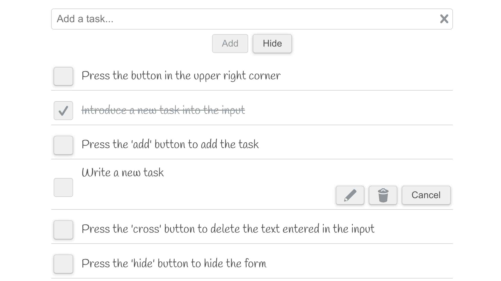

# To Do List App
[Demo](https://tbm85.github.io/demo-to-do-list/)

## Description
A To Do List app created with React JS.

This project was bootstrapped with [Create React App](https://github.com/facebook/create-react-app).

## Resources
* [Lora Font](https://fonts.google.com/specimen/Lora)
* [Handlee Font](https://fonts.google.com/specimen/Handlee)
* [Icomoon Icons](https://icomoon.io/app/#/select)

## How to run this app
* Clone: `git clone https://github.com/TBM85/demo-to-do-list.git`
* Enter in the directory: `cd demo-to-do-list`
* Install dependencies: `npm install`
* Start the app: `npm start`

## What can this application do?
* Add new tasks
* Check and cross out tasks performed
* Edit and change the text in the task
* Delete a task

## License
Copyright (c) 2021 Tania Ballester. This project is using [MIT License](LICENSE.md)